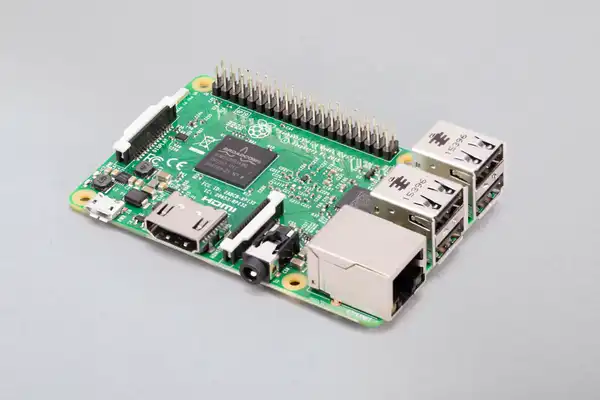

# The Pi 🥧

The Raspberry Pi is a single board computer.  They are about the size of a credit card and have a lot of ports so .

We are using a [Raspberry Pi 3B](https://www.raspberrypi.com/products/raspberry-pi-3-model-b/).  It has the following specs

- Quad Core 1.2Ghz Processor
- 1GB ram
- Ethernet
- 4 USB 2.0
- HDMI
- Micro SD slot (for storage)
- GPIO and Pi specific ports for connecting to cameras, displays and custom electronics

## Connecting it

> IMPORTANT: Connect power LAST, the Pi has no power button so it will startup as soon as power is connected.

Connection checklist
1. Connect display via HDMI port
2. Connect keyboard and mouse via one of 4 USB ports
3. Turn monitor on
4. Connect USB power via port next to HDMI

It will turn on as soon as the USB power is connected

## Turning it off

> IMPORTANT: Unpluging the USB power before the Pi fully powers off can corrupt the SD card

Shutdown checklist
1. Choose shutdown by clicking the Berry->Logout then choosing Shutdown
2. Display will go black but there will still be text at the bottom of the screen.  Wait until this goes away
3. The Activity light will still be blinking.  Wait until it stops blinking
4. The display will go into sleep mode
5. Disconnect USB power
6. Disconnect other cables.