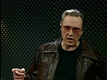

# More pygame



## Finding images to use in your game

This site is a good place to find free to use sprites/images: https://opengameart.org

We will use sprites from these packs:
https://opengameart.org/content/free-top-down-car-sprites-by-unlucky-studio

This repository has copies of the sprites stored in `day-3/sprites/`.  Clone this repository if you do not have it already or pull the latest updates if you do.

#### Clone

```bash
cd ~/source/
git clone https://github.com/b21-python/python2025.git
```

#### Pull/Update

```bash
cd ~/source/python2025/
git pull
```

Once you have the updated `python2025` repository copy the sprites to your source directory


## Simple Car Game

In this game the players car must stay on the road and avoid on coming cars

## Starting code

Start with a game loop similar to the previous game

```python
import pygame

pygame.init() # initialize pygame

# Create a game window that is 640 by 480 pixels
screen = pygame.display.set_mode((640,480))
clock = pygame.time.Clock()
running = True

# Load Car
player = pygame.image.load('sprites/car.png')

# create a variable to store player position so we can modify it based on keyboard input
player_pos = pygame.Vector2(screen.get_width()/2, screen.get_height()/2)

while running:
    # poll for events and react to user closing the window to end the game
    for event in pygame.event.get():
        if event.type == pygame.QUIT:
            running = False

    # Set screen color
    screen.fill("green")

    # Draw player
    screen.blit(player, player_pos)

    # update player position based on keys pressed
    keys = pygame.key.get_pressed()
    if keys[pygame.K_w]:
        player_pos.y -= 10
    if keys[pygame.K_s]:
        player_pos.y += 10
    if keys[pygame.K_a]:
        player_pos.x -= 10
    if keys[pygame.K_d]:
        player_pos.x += 10

    # Render what you've drawn to the screen
    pygame.display.flip()

    clock.tick(60) # limit to 60 FPS

# Exit game when we leave the game loop
pygame.quit()
```

## Add Road

The road can be represented using a grey rectangle drawn over the background and under the car

```python
    # Draw Road                        X   Y  Width  Height
    pygame.draw.rect(screen, "grey", (140, 0, 360,   screen.get_height()))
```

Roads need lines, they can be drawn using the `pygame.draw.line` command.

```python
    # Draw 6 lines that are 20 pixels long, 5 pixels wide and spaced 60 pixels apart
    pygame.draw.line(screen, "white", [h_center, 0], [h_center, 20], 5)
    pygame.draw.line(screen, "white", [h_center, 80], [h_center, 100], 5)
    pygame.draw.line(screen, "white", [h_center, 160], [h_center, 180], 5)
    pygame.draw.line(screen, "white", [h_center, 240], [h_center, 260], 5)
    pygame.draw.line(screen, "white", [h_center, 320], [h_center, 340], 5)
    pygame.draw.line(screen, "white", [h_center, 400], [h_center, 420], 5)
```

How can we make it look like the car is moving up the road?

## Add Movement

We can make it look like the car is driving up the road by making the lines move down.  We can do this with Lists and Loops!

Outside of the game loop define the parameters that describe the lines, the length, width and space between lines.  Then create a list of start positions where to draw lines

```python
# Line parameters
line_length = 20
line_width = 5
line_space = 60

# List of line start positions, notice how range is used
lines = []
for i in range(0, screen.get_height() + 1, 80):
    lines.append(i)
```

Inside the game loop draw that list of lines

```python
    for i in range(len(lines)):
        pygame.draw.line(screen, "white", [h_center, lines[i]], [h_center, lines[i] + line_length], line_width)
```

Finally move the line position each time it's drawn.

Outside the game loop add a variable to hold line speed and set it to 5.

```python
line_speed = 5
```

Inside the loop drawing the lines subtract line_speed from each line position and move the line back to the top of the screen once it's off the screen

```python
    for i in range(len(lines)):
        pygame.draw.line(screen, "white", [h_center, lines[i]], [h_center, lines[i] + line_length], line_width)
        # Move line
        lines[i] += line_speed
        # If off bottom of screen move above top of screen
        if lines[i] >= screen.get_height():
            lines[i] = -(line_space)
```

## Add Traffic

Outside the game loop load all the other vehicles.

```python
# Load Vehicles
vehicles = [
    pygame.image.load('sprites/Ambulance.png'),
    pygame.image.load('sprites/Audi.png'),
    pygame.image.load('sprites/Black_viper.png'),
    pygame.image.load('sprites/Car.png'),
    pygame.image.load('sprites/Mini_truck.png'),
    pygame.image.load('sprites/Mini_van.png'),
    pygame.image.load('sprites/Police.png'),
    pygame.image.load('sprites/truck.png')
]
```

Just like for lines we need to store the position of each vehicle, but we also need to store which sprite to use.  Below the code that lodes the vehicle sprites add an array of lanes

```python
# Create Lanes
lanes = [
    {'pos': 120, 'traffic':[{'v_pos': -100, 'car_id': 0}] },
    {'pos': 300, 'traffic':[] },
]
```

What is this `{'pos':160, 'traffic':[]}`?  It's a dictionary, stores values accessed via keys.  The array of traffic (also a dictionary) will be filled in each lane randomly while the game runs.

Add a variable to control the speed of traffic

```python
traffic_speed = 2 * line_speed
```

Just like with lines we can add a loop to draw the vehicles after we blit the player

```python
    # Draw Traffic
    for lane in lanes:  # Loop over each lane
        for vehicle in lane['traffic']: # Loop over each vehicle in the lane
            # draw the vehicle
            screen.blit(vehicles[vehicle['car_id']], [lane['pos'], vehicle['v_pos']])
            # move the vehicle down the screen
            vehicle['v_pos'] += traffic_speed
        # After all vehicles have been drawn and moved filter out vehicles that have gone off screen
        lane['traffic'] = [vehicle for vehicle in lane['traffic'] if vehicle['v_pos'] < screen.get_height()]
```

Below `traffic_speed` add variables to control how often traffic is spawned

```python
spawn_rate = 1000 #ms
spawn_timer = spawn_rate
```

The `spawn_timer` will count down milliseconds until it is less than or equal to zero, then we will spawn a new vehicle.  To do this we need to track elapsed time.  The `clock.tick(60)` method we use to limit the game to 60 FPS can help us do this because it returns the number of milliseconds since the last call to `tick`.  Update that line to decrement `spawn_timer`.

```python
    spawn_timer -= clock.tick(60) # limit to 60 FPS
```

In the game loop after we draw the player but before we draw traffic add this code to randomly generate traffic.

```python
    # Spawn Traffic
    if spawn_timer <= 0:
        spawn_timer = spawn_rate
        spawn = random.randrange(0, len(vehicles))
        lane = spawn % len(lanes)
        car = spawn % len(vehicles)
        lanes[lane]['traffic'].append({'v_pos':-(player.get_height()), 'car_id':car})
```

> NOTE: you need to import the `random` library to be able to call `random.randrange`.  To do so add `import random` at the top of the file after `import pygame`.

## Make the screen bigger

The cars are really big compared with the screen.  We could make the cars smaller or make the play area bigger.  If we made the car smaller it would be too small for the road.  We could solve the problem if we made the screen taller.  Double it's height to `960` pixels.  

> Because we made the code relative to the size of the screen we should only have to change one value.  If we had hard coded those values we would have to update a lot of values and it would be easy to introduce a bug.


## Rotate the traffic

The traffic is driving backwards, we need to rotate each sprite 180 degrees.  To do this easily we will write a function to do it for us.

```python
def prepareTraffic(sprite):
    rotated_sprite = pygame.transform.rotate(sprite, 180)
    return rotated_sprite
```

Modify each line that loads a vehicle to call this method

```python
# Load Vehicles
vehicles = [
    prepareTraffic(pygame.image.load('sprites/Ambulance.png')),
    #...
```


## Detect crashes and add end screen

To detect crashes we need to see if the two images overlap.  There are many ways to do this, we are going to start with the wrong way.

When an image is blit to another the blit function returns a rectangle representing the area that was modified.  If we compare the intersection of the rectangle for the player and another car we can see is they intersect

Modify the call to blit the player to store the bounding box

```python
    player_box = screen.blit(player, player_pos)
```

Do the same for the code that draws each vehicle of the traffic, then see if they collide.  If they do end the game.

```python
            vehicle_box = screen.blit(vehicles[vehicle['car_id']], [lane['pos'], vehicle['v_pos']])
            if player_box.colliderect(vehicle_box):
                running = False
```

If we run it now the game will quit as soon as there is a crash, we can add another game loop right before `pygame.quit()` to keep the game open after we die, this could be the game over screen in the future.

```python
running = True
while running:
    # poll for events and react to user closing the window to end the game
    for event in pygame.event.get():
        if event.type == pygame.QUIT:
            running = False
```

Give it a try!

## Improve the crash detection

This is also not the right way to do this but it will work until we start using Pygame Sprites.

The problem is that the vehicle pictures are square with alpha mask to make them appear non-square.  Add the following two print lines to output the rectangles that we are colliding:

```python
            if player_box.colliderect(vehicle_box):
                print(player_box)
                print(vehicle_box)
                running = False
```

Notice that they are 256 by 256 pixels.

The way we will solve this problem today is to crop the images to be as close to the size of the visible image as possible.  Add this method above `prepareTraffic`

```python
def cropAlpha(surface):
    final_size = surface.get_bounding_rect()
    cropped = pygame.Surface((final_size.width, final_size.height), pygame.SRCALPHA, 32)
    cropped.blit(surface, (0,0), final_size)
    cropped = cropped.convert_alpha()
    return cropped
```

Then use this method to crop the player and modify `prepareTraffic` to call the method so traffic sprites are cropped as well.

```python
def prepareTraffic(sprite):
    rotated_sprite = pygame.transform.rotate(sprite, 180)
    return cropAlpha(rotated_sprite)

# Load Player
player = cropAlpha(pygame.image.load('sprites/car.png'))
```

Run the game again and note the size of the sprites printed out when there is a collision.

## Fix traffic lane spacing

Now that we've trimmed the sprites the lanes are not in the right position.  Modify the following code to get the cars to appear in their lane.

```python
# Create Lanes
lanes = [
    {'pos': 120, 'traffic':[{'v_pos': -100, 'car_id': 0}] },
    {'pos': 300, 'traffic':[] },
]
```

What else could be done to improve this game?